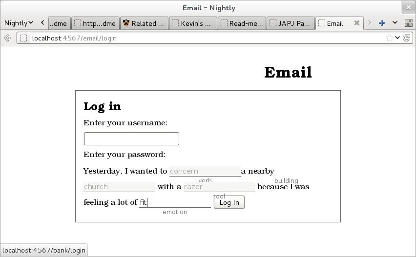

Part 1
======

PassLibs: Our New Password Scheme
---------------------------------
This scheme is based on the old "game" of Mad Libs -- filling in blanks in a sentence with random words resulting in hilarity. PassLibs generates the sentence and picks random words to fill in the blanks; you have to remember the words that go in the blanks. 

We tried to take advantage of several features from the two image-based password schemes presented in the guest lectures. We liked the progressive feedback mechanism that lets you know immediately if the previous part was wrong. Also, by varying the next part based on the response to the previous one, we can have many more possible sentences.

The Mad Libs idea should also be more memorable than random words without context because we expect most sentences to be funny -- and humour is memorable. The primary requirement for this to work is that the sentences be gramatically correct (or close enough to forgive). Since our passwords (passphrases) are full sentences, users may also be able to visualize a scene or treat the password as a story.

A particularly important feature, we thought, was the context the sentence might give a user. Not only would it help narrow down what kind of word they're trying to remember, but it could also be different for each site. One of the problems with regular passwords is that they all fit at pretty much every site, so you may not know which to use and just try them all. But if your passwords start "On the weekend, my [relative] *brother* ..." and "My pet [animal] *otter*..." it's hard to use one in place of the other (modulo very strange genealogy).

Password space
--------------

The password space for this scheme is clearly adjustable. Variables such as the dictionary used, the categories for the blanks, and the number of blanks all affect the password space. We chose 4-blank sentences fairly arbitrarily and didn't think much about the password space when making up the sentences. This still left the dictionary from which the computer fills in the blanks as a variable, so calculating the password space is not possible without an implementation.

The main dictionary is WordNet, since its hyponym trees let us generate lists of nouns in particular categories (e.g. we can get a list of many kinds of "food"). I was unable to break other parts of speech up into categories with the word lists I could find. WordNet, however, includes some pretty esoteric and hard-to-remember (or spell) words, plus some fairly long noun phrases which weren't appropriate either. Therefore, we filtered the lists of words, limiting them to ones in the SCOWL Spell-Checker Oriented Word List. As SCOWL is also parameterizable, there are about a dozen size categories that add increasingly rare words. To get about 28 bits of password space, we ran a program to calculate the password space and then chose smaller and smaller spellcheck filters until the results were close.

Since the number of passwords depends on which branches of the tree of sentence frames are chosen, we had to write a program to traverse all paths. The password space for each leaf node in the tree is the number of possibilities at that node, multiplied by, for each of its ancestors, the number of possibilities at that node divided by the number of children (since only 1/n of the possibilities lead down each path). The approximate password space for the whole tree is then the average of the spaces for each leaf node.

Using the above algorithm, we have password spaces of 33.3, 26.1, and 28.8 bits for the three trees (one tree per site).

Implementation
--------------

###Screenshots

1. : The intro page
2. : Creating a password for one site. (You can already see that some words don't fit quite right. We should have spent more time refining the sentences.)
3. : We offered users a chance to practice more.
4. : Password entry (it's going to be right).
5. : It was right!
6. : Other "sites" had different frames. I also tried to make them visually distinct.
7. : When one word is wrong, the subsequent chunks may be different too.
8. : We knew that wasn't right.

The program has two main components. The password generation is handled by the Python program `generator.py`; all the web stuff is handled by Ruby (the server is in `pass.rb`).

Dependencies:
------------

You need Python, Ruby, NLTK (python-nltk in Fedora) and several rubygems: sinatra, json, and rubypython (and their respective dependencies). In order to build the gems (with gem install X) on most common Linux distributions, you need to make sure you have -devel packages as well -- python-devel, ruby-devel, libffi-devel, and any others it may complain about. Apparently this isn't a problem for Mac OS users.

###Password generation: generator.py

This is the interesting file! Unfortunately, it's kind of hacked together.

`readtree()` parses the file `sentence.frames` according to indentation level, creating a proper tree structure. Then `generatephrase()` creates a Chunk for each level and follows the appropriate branch according to `pickchild()`. A Chunk is one part of the sentence with exactly one blank in it. It also corresponds to one line in `sentence.frames`. `pickchild()` is supposed to deterministically choose one branch with equal probability for each branch. This implementation seems somewhat biased. Each chunk picks its own word using `passablewords()`, which returns a list of all the words that fit into the right category. (Only nouns and names do anything really special: names just have their own list, from the US 1990 census; nouns get all words in their hyponym tree.) The list is filtered by the spellchecker list. Several spellchecker lists are included; spellcheck.20 got us to about 28 bits.

Web server: pass.rb, *.erb
--------------------------

These don't do much of interest. They just present the user interface and check the passwords for match/mismatch. 

The server logs provide good instrumentation already, since each chunk requires a fetch from the server. The next chunk is retrieved from the URL `/{site}/api/nextchunk/firstword/secondword/etc`. so the words that have been entered are logged and timestamped automatically!

Note that for ease of implementation, the server does not handle multiple concurrent users. It keeps the passwords in memory, not in a database. There is no database.

Questionnaire
---------------
[http://hotsoft.carleton.ca/comp3008survey/index.php?sid=32143&lang=en] (http://hotsoft.carleton.ca/comp3008survey/index.php?sid=32143&lang=en)

[*** include PDF from LimeSurvey! ***]

Pre-testing analysis
--------------------

From watching users, several problems were immediately obvious:

Our password assignment page only forced users to enter their passwords once, so most users did just that and proptly forgot them. A couple of users wanted to go back and find out what their first password had been after being assigned their second password. (Our program didn't support that.)

Nevertheless, when it came to logging in, they got about three words of four right. (Accuracy also increased as we got to more-recently-assigned passwords. The first two participants successfully logged into Domesday but not the other two sites.) This suggests that forcing the user to enter the password more than once, perhaps with the option to hide the answer like in the MVP password trainer, might improve results.

Another glaring problem was that while all the generated words were common words, they weren't all commonly used in the context of the generated sentence. For example, "issue" is a common word, but it's pretty rarely used to describe a relative. WordNet does include frequency information for some words, but not always for each sense of the word. In any case, we didn't try to make use of that information for this prototype.

These failures in generating good sentences meant that sometimes users did have to request another password. Then they got a little mixed up between words from the old and new sentences.

Participants Log
----------------

Can be found in the `participants-1-and-2.log` file included in the Software zip file.

